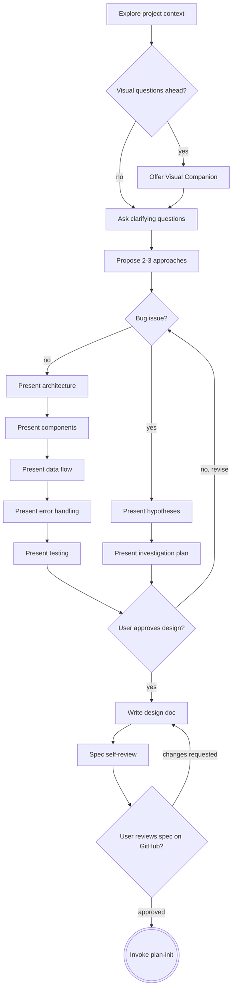

# Plan: Break 'Present design' into per-section todo items in /refine checklist

**Issue:** https://github.com/0k-software/.github/issues/101

## Summary

The `/refine` checklist has a single step for "Present design" (step 5). This
means Claude creates one todo for the entire design presentation phase, giving
users no visibility into which sections remain. The fix is to replace that
single step with individual numbered steps — one per design section — so each
becomes its own todo item.

## Approach

Two edits to `0k/skills/refine/SKILL.md`: replace checklist step 5 with
per-section steps (split into feature and bug tracks), and update the process
flow diagram to show the same split visually.

## Steps

- [ ] [Step 1: Expand checklist step 5 into per-section steps](#step-1-expand-checklist-step-5-into-per-section-steps)
- [ ] [Step 2: Update process flow diagram with bug vs feature tracks](#step-2-update-process-flow-diagram-with-bug-vs-feature-tracks)

---

## Step 1: Expand checklist step 5 into per-section steps

In `0k/skills/refine/SKILL.md`, replace:

```
5. **Present design** — section by section, get approval as you go
```

**For feature / enhancement / task / pitch issues**, with:

```
5. **Present architecture** — get approval; if N/A, complete and note why
6. **Present components** — get approval; if N/A, complete and note why
7. **Present data flow** — get approval; if N/A, complete and note why
8. **Present error handling** — get approval; if N/A, complete and note why
9. **Present testing** — get approval; if N/A, complete and note why
```

**For bug issues**, with these two steps instead (steps 7–9 are N/A for bugs):

```
5. **Present hypotheses** — 2-3 root cause candidates; get approval; if N/A, note why
6. **Present investigation plan** — where to look, what to instrument; get approval
```

Then renumber the remaining checklist items from 6–9 to 10–13:

- Step 6 → 10: Write design doc
- Step 7 → 11: Spec self-review
- Step 8 → 12: User reviews spec on GitHub
- Step 9 → 13: Invoke plan-init

---

## Step 2: Update process flow diagram with bug vs feature tracks

In `0k/skills/refine/SKILL.md`, replace the `Process Flow` mermaid diagram to
split `F[Present design sections]` into parallel bug and feature tracks:


